# 🚀 Trackly - Project Management System

A modern Jira-inspired Project Management application built using **Java 17, Spring Boot, Spring Security, JWT Authentication, React.js, MySQL, Hibernate, and Docker**.

Trackly enables teams to create projects, manage tasks using a Kanban board, assign work, and securely collaborate through a RESTful backend.


# 📸 Application Screenshots

## Login

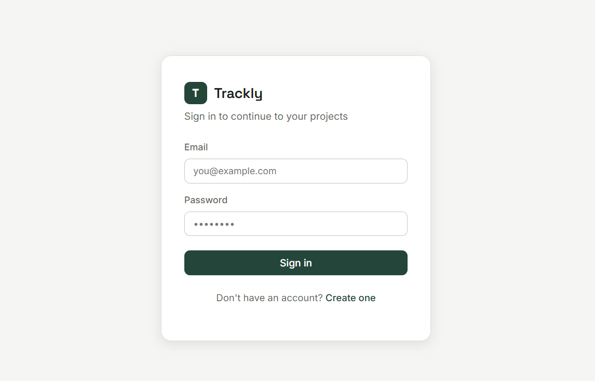

---

## Register

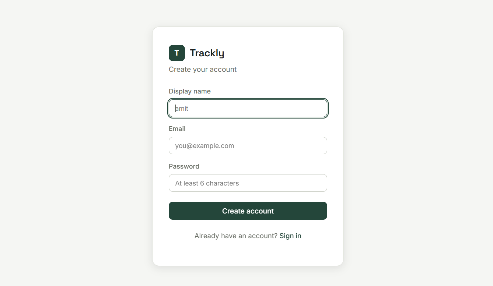

---

## Dashboard

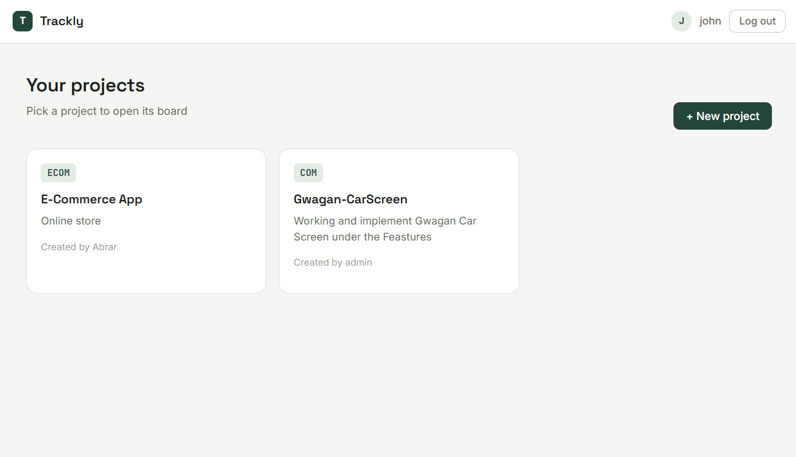

---

## Create Project

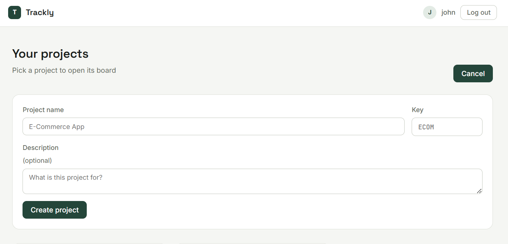

---

## Project Details Kanban Borad

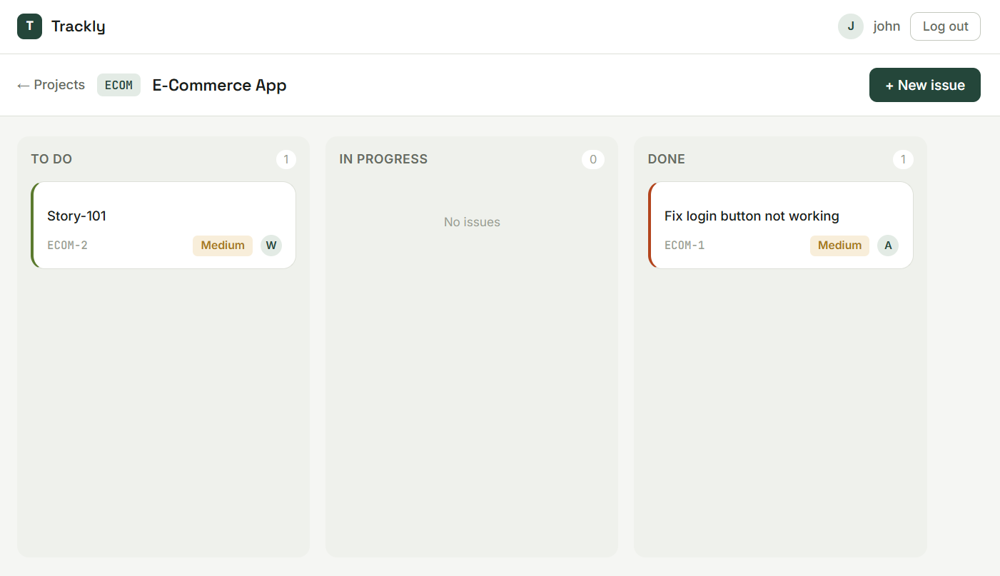

---

## Kanban Board


---

## Create Task

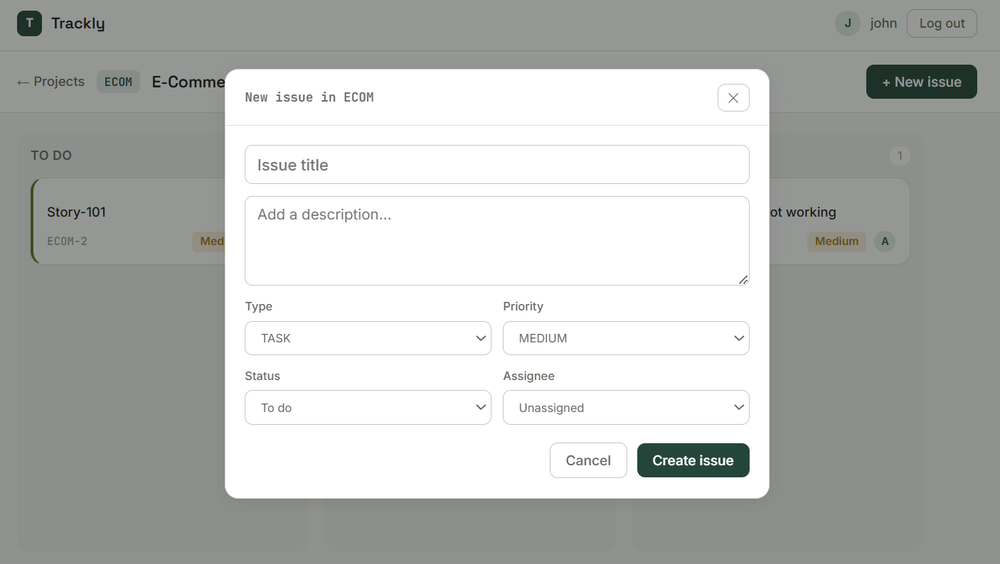

---

## Task Details

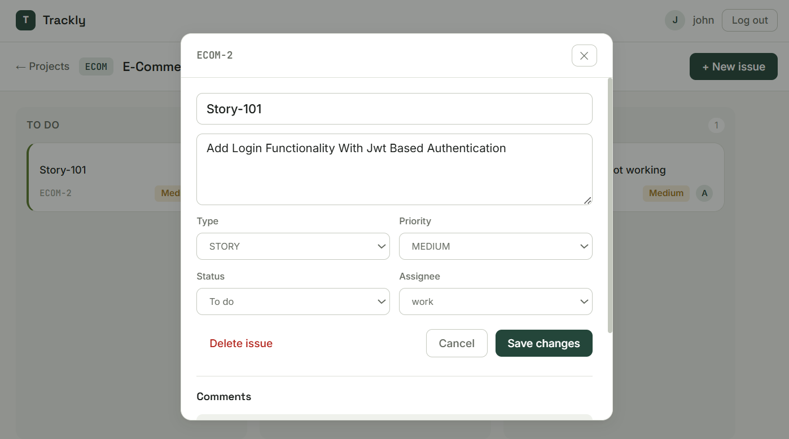

---

# 🔐 Authentication

- JWT Authentication
- Spring Security
- Role Based Authorization
- BCrypt Password Encryption

Swagger Authentication

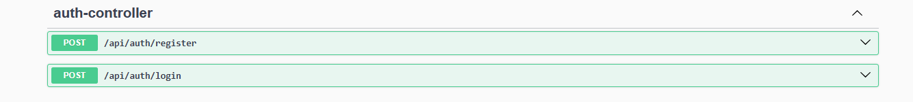
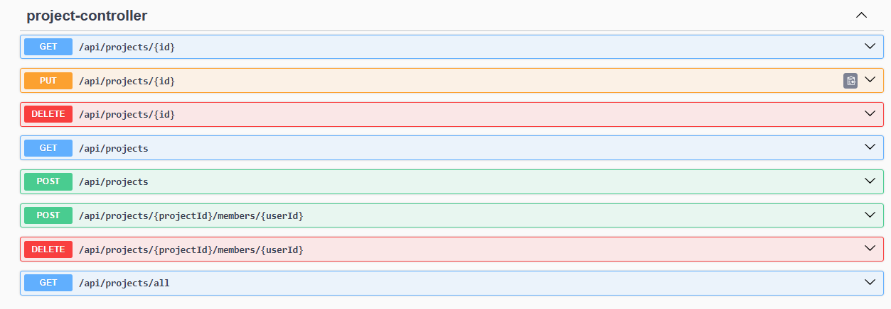
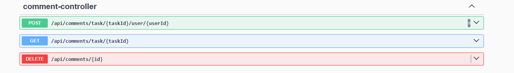
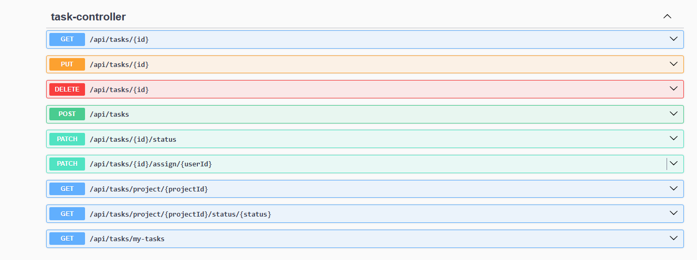


---


---

# ✨ Features

- User Registration
- Secure Login using JWT
- Spring Security
- Role Based Authorization
- Project Management
- Task Management
- Task Assignment
- Kanban Board
- Dashboard
- REST APIs
- Global Exception Handling
- Validation
- Swagger Documentation
- Docker Support
- Clean Layered Architecture

---

# 🛠 Tech Stack

## Backend

- Java 17
- Spring Boot
- Spring Security
- Spring Data JPA
- Hibernate
- JWT
- Maven

## Frontend

- React.js
- Vite
- Bootstrap
- Axios

## Database

- MySQL

## Documentation

- Swagger OpenAPI


---

# 📂 Project Structure

src

├── controller

├── service

├── repository

├── entity

├── dto

├── security

├── config

├── exception

└── util

---

# 🚀 Getting Started

## Clone Repository

```bash
git clone https://github.com/yourusername/trackly-backend.git
```

```bash
cd trackly-backend
```

---

## Configure Database

Update application.properties

```properties
spring.datasource.url=jdbc:mysql://localhost:3306/trackly

spring.datasource.username=root

spring.datasource.password=yourpassword
```

---

## Run Project

```bash
mvn clean install
```

```bash
mvn spring-boot:run
```


# 🔗 REST API Endpoints

## Authentication

POST /api/auth/register

POST /api/auth/login

---

## Projects

GET /api/projects

POST /api/projects

PUT /api/projects/{id}

DELETE /api/projects/{id}

---

## Tasks

GET /api/tasks

POST /api/tasks

PUT /api/tasks/{id}

PATCH /api/tasks/{id}/status

DELETE /api/tasks/{id}

---

# 🔒 Security

- JWT Token Authentication
- Stateless Session Management
- Password Encryption
- Protected REST APIs
- Role Based Access Control

---

# 📈 Future Enhancements

- Email Notifications
- File Attachments
- Activity Timeline
- Search & Filtering
- Team Management
- Admin Dashboard
- CI/CD Pipeline
- Kubernetes Deployment
- AWS Deployment

---
# ==============================================================
# ⚛️ Frontend Tech Stack

- React.js
- Vite
- JavaScript (ES6+)
- Bootstrap 5
- React Router DOM
- Axios
- React Icons
- @hello-pangea/dnd (Drag & Drop)
- Context API
- Local Storage (JWT)


# 📂 Frontend Structure

src/

├── api/

├── assets/

├── components/

├── context/

├── layouts/

├── pages/

├── services/

├── styles/

├── utils/

├── App.jsx

└── main.jsx


# 🚀 Frontend Setup

```bash
git clone <repository-url>
```

```bash
cd trackly-frontend
```

```bash
npm install
```

```bash
npm run dev
```

Application will be available at:

```
http://localhost:5173
```


## 👨‍💻 Developer

**Abrar Shaikh**

📧 Email: uddinabru@gmail.com.com

💼 LinkedIn: https://www.linkedin.com/in/abrar-java-developer/

Java Full Stack Developer

- Java
- Spring Boot
- Spring Security
- Hibernate
- MySQL
- React.js

